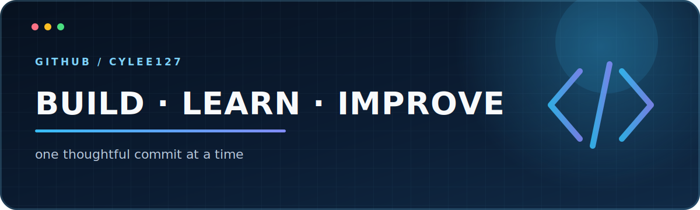

# cylee127

안녕하세요. 작은 아이디어를 직접 만들고, 배운 것을 기록하며,
어제보다 나은 결과를 쌓아가고 있습니다.

> 작게 만들고, 꾸준히 배우며, 계속 개선합니다.

## 지금의 방향

- **Build** — 아이디어를 작동하는 결과물로 옮깁니다.
- **Learn** — 새롭게 배운 내용을 직접 실험하고 기록합니다.
- **Improve** — 한 번에 완벽하기보다 꾸준한 개선을 선택합니다.

## 공개 프로젝트

| 프로젝트 | 소개 |
| --- | --- |
| [2026_DKU_OpenSourceSWBasic](https://github.com/cylee127/2026_DKU_OpenSourceSWBasic) | 오픈소스 SW 기초 학습 기록 |

## 작업 방식

명확하게 이해하고, 단순하게 만들고, 확인하며 개선하는 과정을 좋아합니다.
오늘의 작은 커밋이 내일의 더 나은 프로젝트가 된다고 믿습니다.

---

찾아와 주셔서 감사합니다. 천천히, 하지만 꾸준히 채워가겠습니다.
